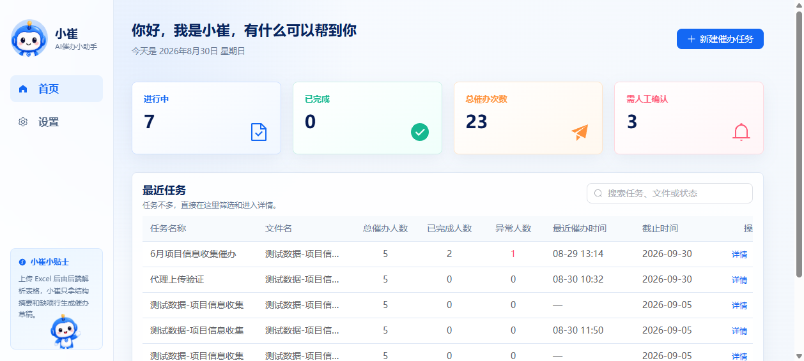
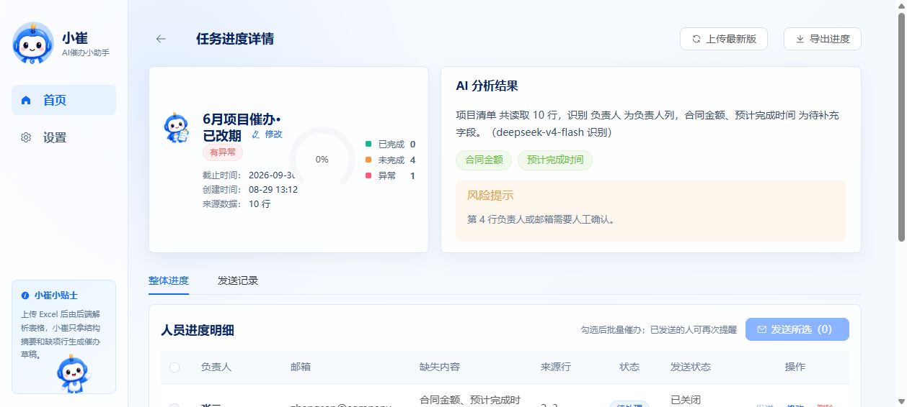
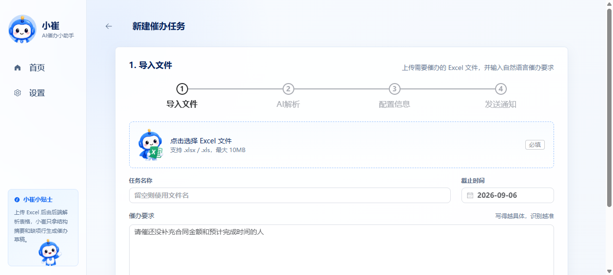
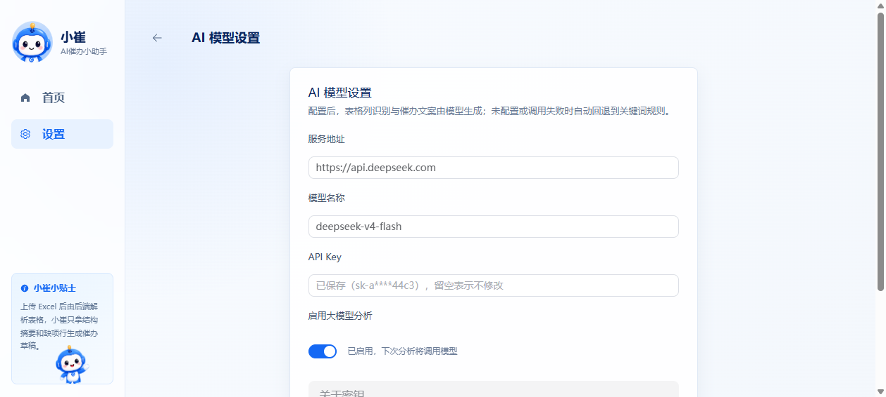

# 小崔 · AI 催办小助理

> 上传一份 Excel 项目信息表,小崔自动识别负责人、找出还没补齐的关键字段,生成可直接发出去的催办草稿,并支持后续对账与批量提醒。



## ✨ 这是什么

**小崔(xiaocui)** 是一个面向"项目信息收集"场景的 AI 催办小助理。
在企业里,你经常会让人填一份 Excel 收集项目进度,过几天总有人没填或填得不齐。
小崔做的事情只有一件:**把这份表变成一份可发出去的催办任务列表**,并跟踪谁回了、谁还没回。

它不是群发机器人,也不是 OA 表单,而是**贴在 Excel 上的 AI 同事**:
你告诉它"催还没补充合同金额和预计完成时间的人",它就把这件事拆好摆在你面前。

## 🚀 核心特性

- **📄 一键导入 Excel** —— 支持 `.xlsx` / `.xls`,自动识别表头、数据类型、缺失值分布。
- **🤖 AI 字段识别** —— 哪一列是负责人、哪一列是部门、哪一列是邮箱,让 LLM 给你列清楚,带风险提示。
- **✍️ 催办文案草稿** —— 针对每个待补充人员,生成可直接发送的催办消息(基于用户的自然语言指令)。
- **🔁 增量对账** —— 上传最新版 Excel,先预览**新增 / 已补齐 / 仍缺失**的差异,确认后再应用,避免误覆盖。
- **👥 多人合并行支持** —— 一个项目多负责人 / 部门合并单元格也能正确展开。
- **🔌 多种 AI 后端** —— 支持自填 OpenAI 兼容 API(如 DeepSeek);未配置时自动回退到关键词规则,服务永不掉线。
- **🛡️ 隐私可控** —— Excel 文件留在你自己的机器上,数据库是本地 SQLite 文件,API Key 在设置页加密保存。
- **🎨 友好的 UI** —— Element Plus + Element 风格的卡片 / 表格 / 向导,小崔吉祥物全程陪伴。

## 📸 界面预览

### 1. 控制台(任务总览)
首页一眼看到所有催办任务的状态分布与最近进度。


### 2. 任务详情(AI 分析 + 人员明细)
AI 告诉你"识别到的负责人列是 X,待补充字段是合同金额、预计完成时间",并把每行的状态、缺失项、消息草稿列出来。



### 3. 新建任务(4 步向导)
上传 Excel → 写一句自然语言催办要求 → 设置截止时间 → 预览人员 → 完成。中间任何一步都可以返回修改。



### 4. AI 模型设置
填写服务地址、模型名、API Key,即可启用模型能力;不填也能用规则版。



## 🧱 技术栈

| 端 | 技术 |
| --- | --- |
| **前端** | Vue 3 · TypeScript · Vite 6 · Pinia · Vue Router 4 · Element Plus |
| **后端** | Node.js 22 · TypeScript · Express 4 · multer · SheetJS · `node:sqlite`（内置 SQLite） |
| **AI** | OpenAI 兼容 API(默认指向 DeepSeek `deepseek-v4-flash`),失败时回退规则引擎 |

## 📁 项目结构

```
xiaocui/
├── frontend/                  # 前端(Vue 3 + TS)
│   ├── src/
│   │   ├── views/             # 页面:ConsoleView / NewTaskView / TaskDetailView / SettingsView
│   │   ├── components/        # 复用组件
│   │   ├── layouts/           # AppLayout 主壳
│   │   ├── router/            # 路由(hash 模式)
│   │   ├── services/          # 与后端 API 通信
│   │   ├── stores/            # Pinia 状态
│   │   └── styles.css         # 全局样式 + 小崔配色
│   ├── public/                # 静态资源(图标等)
│   ├── index.html             # Vite 入口
│   ├── package.json
│   └── vite.config.ts         # dev 代理:/api → 127.0.0.1:8080
├── backend-ts/                # 后端(TypeScript + Express)
│   └── src/
│       ├── index.ts           # 入口(端口 8080)
│       ├── app.ts             # REST 路由 + 异常处理
│       ├── repository.ts      # SQLite 数据访问层(node:sqlite)
│       ├── workbook.ts        # Excel 解析(表头探测/合并单元格下推)
│       ├── tableProfile.ts    # 表头与字段画像
│       ├── ruleBased.ts       # 规则版 AI 识列
│       ├── openAiAnalysis.ts  # OpenAI 兼容模型识列
│       ├── aiRouting.ts       # AI/规则路由降级
│       ├── draftBuilder.ts    # 催办文案生成
│       ├── followupService.ts # 催办任务、条目、对账、发送
│       ├── sessionService.ts  # 分析会话
│       ├── contact.ts         # 联系人匹配
│       ├── addressBook.ts     # 通讯录
│       ├── settings.ts        # AI 设置
│       └── sender.ts          # 发送器(当前为 manual 复制)
├── docs/                      # 设计文档 & 截图
│   ├── mvp-technical-design.md
│   ├── architecture-recommendation.md
│   ├── domain-model.md
│   ├── reminder-tool-plan.md
│   ├── adr-001 ~ adr-004      # 关键架构决策记录
│   └── screenshots/           # README 用的截图
└── 测试数据-项目信息收集.xlsx
```

## ⚡ 快速开始

### 环境要求

- **Node.js** 18+ (推荐 20/22,后端用到内置 `node:sqlite`,建议 22+)

### 1. 克隆 & 安装

```bash
git clone https://github.com/Zivissoziv/xiaocui.git
cd xiaocui/frontend
npm install
```

### 2. 启动后端(端口 8080)

```bash
cd backend-ts
npm install
npx tsc
node dist/index.js
```

后端启动后会:
- 在 `backend-ts/data/ai_followup.db` 创建 SQLite 文件数据库
- 在 `backend-ts/uploads/` 存放上传的 Excel
- 在 `http://127.0.0.1:8080/api/...` 提供 REST API(与原 Java 版契约一致)

### 3. 启动前端(端口 5173)

```bash
# 在项目根目录
cd frontend
npm run dev
```

打开浏览器访问:<http://127.0.0.1:5173>

前端默认通过 Vite 代理把 `/api` 转发到 `http://127.0.0.1:8080`,无需额外配置 CORS。

### 4.(可选)配置 AI 模型

首次打开后,进入 **设置 → AI 模型设置**:
- 服务地址(默认 `https://api.deepseek.com`)
- 模型名称(默认 `deepseek-v4-flash`)
- API Key(留空表示不修改,已保存会显示掩码)

不配置也能用 —— 会自动回退到内置的规则识别引擎。

## 🧭 使用流程

```
┌─────────────┐    ┌─────────────┐    ┌─────────────┐    ┌─────────────┐
│  上传 Excel │ →  │  AI 解析表  │ →  │  人员明细   │ →  │  批量催办   │
│  + 自然语言 │    │  + 风险提示 │    │  + 草稿     │    │  + 对账     │
└─────────────┘    └─────────────┘    └─────────────┘    └─────────────┘
```

1. **新建任务** → 上传 Excel + 写一句"请催还没补齐合同金额和预计完成时间的人"。
2. **AI 解析** → 后端读取表头和前若干行,调用模型(或规则)输出:
   - `tableSummary`:这张表大致是做什么的
   - `columnPlan`:哪个列是负责人 / 部门 / 邮箱
   - `risks`:哪些行需要人工确认
3. **人员明细** → 按行展开每个待催办的人,可编辑姓名 / 工号 / 邮箱,改完保存。
4. **批量催办** → 勾选要发送的人,确认文案(可逐条微调),触发"发送"。当前是 manual 模式(把文案复制到剪贴板),后续可接入邮件 / IM。
5. **增量对账** → 同事把 Excel 补齐后又传一份,小崔告诉你"新增 2 人、已补齐 5 人、还差 1 人",你确认后再合并。

## 🧠 关键设计(为什么这样做)

- **AI 与规则并存**:`RoutingAiAnalysisService` 优先用模型,失败时静默回退到 `RuleBasedAiAnalysisService`。配置永远不强制。
- **差异预览,先看再合**:`/api/analysis-sessions/{id}/refresh-preview` 只返回差异,用户点击"确认应用"才走真正落库 —— 避免"再传一次 Excel 就把数据覆盖了"的焦虑。
- **多负责人 / 合并单元格**:`FollowupService` 解析时按合并区展开,一个人可以同时属于多个项目。
- **本机优先**:`backend-ts/uploads` + SQLite 文件库,Excel 不出本机,适合内部催办这种敏感数据。

详细设计见 [`docs/`](./docs/):
- [MVP 技术设计](./docs/mvp-technical-design.md)
- [架构推荐](./docs/architecture-recommendation.md)
- [领域模型](./docs/domain-model.md)
- [催办工具规划](./docs/reminder-tool-plan.md)
- [ADR-001: 表源为先](./docs/adr-001-form-source-first.md)
- [ADR-002: 提醒即审计事件](./docs/adr-002-reminder-as-audit-event.md)
- [ADR-003: Excel 状态以"列完整度"为依据](./docs/adr-003-excel-status-by-column-completeness.md)
- [ADR-004: AI 辅助生成催办](./docs/adr-004-ai-assisted-followup-generation.md)

## 🔌 REST API 概览

| Method | Path | 说明 |
| --- | --- | --- |
| `POST` | `/api/analysis-sessions` | 上传 Excel,创建新会话(返回完整 SessionDetail) |
| `GET`  | `/api/analysis-sessions/details` | 拉取所有会话的完整详情(首页用) |
| `GET`  | `/api/analysis-sessions/{id}` | 拉取单个会话完整详情 |
| `POST` | `/api/analysis-sessions/{id}/refresh-preview` | 上传最新版 Excel,只返回差异 |
| `POST` | `/api/analysis-sessions/{id}/refresh/confirm` | 确认应用预览(不重跑模型) |
| `POST` | `/api/analysis-sessions/{id}/followup-tasks/send` | 批量发送催办(manual 模式复制到剪贴板) |
| `PATCH`| `/api/followup-items/{id}` | 修改单条人员信息或最终文案 |
| `DELETE`| `/api/followup-items/{id}` | 删除一条待补充人员(连带任务/留痕) |
| `DELETE`| `/api/analysis-sessions/{id}` | 删除整个催办任务 |
| `GET`  | `/api/settings/ai` | 获取 AI 设置(apiKey 返回掩码) |
| `PUT`  | `/api/settings/ai` | 更新 AI 设置 |
| `POST` | `/api/settings/ai/test` | 测试当前 AI 配置是否可用 |

## 🧪 测试数据

仓库根目录附了一份 `测试数据-项目信息收集.xlsx` —— 包含 10 行项目信息,部分行有缺项,可以直接拿来跑一遍完整流程。

## 🛣️ 路线图

- [ ] 真实发送渠道(企业微信 / 邮件)接入
- [ ] 多 Sheet 合并识别
- [ ] 角色与权限(创建人只能看自己的催办)
- [ ] 定时重催(到期未回自动提醒)
- [ ] Docker 一键启动

## 🤝 贡献

欢迎提 Issue / PR。改前端请保持 Element Plus 风格,改后端请在 `docs/adr/` 下补一篇 ADR 说明动机。

## 📄 License

MIT
